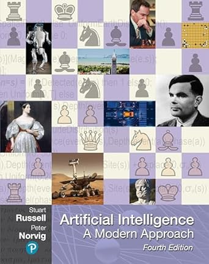
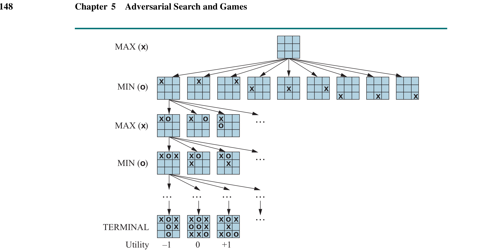

# Tic Tac Toe
### Day Build  
**08/06/25**

It was the spring semester of 2023, right after winter break — that winter break when ChatGPT was released. I had signed up for an AI course because it was necessary to graduate. Before I even knew of such a tool, the class got packed once GPT became a thing.

We were required to get *Artificial Intelligence: A Modern Approach* (4th edition). On the cover, you see Alan Turing, what appears to be Garry Kasparov, the Mars rover, a robot, a statue, a painting, a game of Go, and many more small details — all on a chessboard background. If I judged a book by its cover, I would say this was going to be a great book.

  
*Artificial Intelligence: A Modern Approach - 4th Edition*

The professor of the class was none other than one of the best professors at NEIU at the time: **Professor Kimmel** — feared by many, avoided by even more. Professor Kimmel was not an easy professor; he made sure you knew the subject. His exams were on paper — no multiple choice answers. You had to write down the algorithms on paper, and your code had to be correct — no syntax errors, no pseudocode allowed. 

The assignments were between 6-9 coding problems that built on each other: make `foo()` call on `bar()`, which relies on `waldo()`; so you really had to get the first problem right to continue to the next problem.

Great book, great professor, and Python — which we only got a cheat sheet for, converting our knowledge from Java and kind of translating some of Python's quirks (what even is `lambda`?).

One of the things we did a lot was create AI agents to play games. One such game was the **Divisor Game**, which utilized the **Minimax algorithm**. In Chapter 5 of the book, where Minimax is covered, there was a diagram of a Tic-Tac-Toe game with an image of the Minimax algorithm doing its work, but I did not have the skills to implement that then. I tried for about a day, but it was definitely a skill issue — that and I had taken two of Professor Kimmel’s classes (AI and Algorithms), both equally challenging, and we used Java for Algorithms (context switch programming languages).

  
*Diagram from Chapter 5 showing Minimax algorithm in Tic-Tac-Toe*

---

Here we are, in a work-in-progress website, and I have little to no projects to showcase. Well, today I decided to finally build that Minimax Tic-Tac-Toe agent.

At first, I thought the agent would live on a server, with each move triggered by an API call — I wasn’t sure how frequently the AI would be used. So I went with the next best approach: I JSON-ified it. I built the logic in Java (TODO: upload to GitHub), then structured the output as simple key-value pairs (GameState, bestMove), where the game state is represented as a string.

- Empty game: `"---------"`  
- First player moves center: `"----X----"`  
- Countered by a move in the top-left corner: `"O---X----"`  
- And so on.

The React code was done quick and dirty; it just loads the JSON files and plays the optimal move.

Feel free to play the game and let me know if you can beat the agent!

